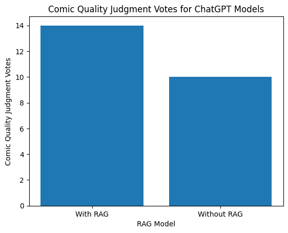
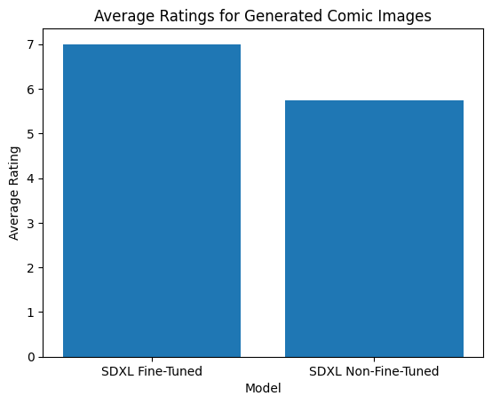
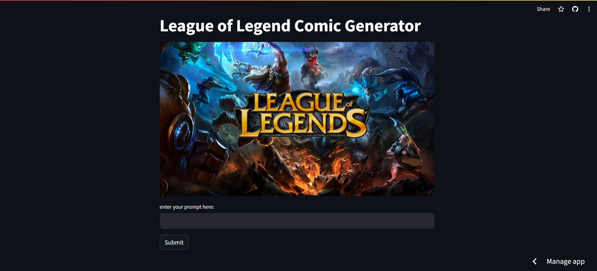

# LoL Comic Generation

## Problem Statement

The League of Legends (LoL) universe, created by Riot Games, is a rich and expansive world filled with unique champions and their skins (visual representations). While the existing universe is already vast, there is an opportunity to further enrich it by generating new champion skins, background stories, and corresponding visual representations of these stories. This project aims to leverage artificial intelligence to create new comic for the LoL universe, so this application involves generating League of Legends comic scripts using ChatGPT 3.5 based on RAG (Retrieval-Augmented Generation), and then generating corresponding comic images using the stable diffusion XL model fine-tuned with Dream Booth. Finally, I built a frontend UI interface using Streamlit and deployed it to the cloud.

## Data Sources

The primary data sources for this project include:

- Publicly available datasets of LoL champion images and skin artworks from [SkinExplorer](https://www.skinexplorer.lol/).
- Textual descriptions of champions and their lore from the official LoL universe page: [Universe of League of Legends](https://universe.leagueoflegends.com/en_US/story/).
- Official LoL fan-made comics as an alternative data source: [Universe of League of Legends Comics](https://universe.leagueoflegends.com/en_US/comic/).
- Fan-made textual works from websites like [Reddit](https://www.reddit.com/r/leagueoflegends/comments/loj1xo/collected_the_lore_on_universe_into_an_ebook/).

## Previous Efforts and Literature Review

Previous efforts have been made to use artificial intelligence to expand game universes. Notable examples include:

- OpenAI's GPT models have been used to generate textual content such as stories and dialogues.
- Image generation models like DALL-E have been utilized to create visual content based on textual prompts.
- Various models fine-tuned using the Stable Diffusion model can be found on platforms like Hugging Face (https://huggingface.co/models) and Civitai (https://civitai.com/models).

#### Recurrent Neural Networks (RNNs) 
RNN are commonly used for text generation tasks due to their ability to capture sequential dependencies and generate coherent text. Here's how RNNs are typically used for text generation:

Sequential Modeling: RNNs are well-suited for sequential data processing.
Learning Sequential Patterns: RNNs learn to capture the sequential patterns in the input text data. 
Generating Output: After being trained on a large corpus of text data, an RNN can generate text by sampling from the output distribution of the model at each time step.
Long-Term Dependencies: One challenge with traditional RNNs is their difficulty in capturing long-term dependencies in the input data. As the sequence gets longer, RNNs may suffer from vanishing or exploding gradients, which can degrade their ability to remember information from earlier time steps. However, techniques like Long Short-Term Memory (LSTM) and Gated Recurrent Unit (GRU) have been developed to address this issue by introducing mechanisms to selectively retain and forget information over longer sequences.
Conditional Generation: RNNs can also be used for conditional text generation, where the generation process is conditioned on additional input information. This could include generating text based on a specific topic, style, or context, allowing for more controlled and targeted text generation.

#### Generative Adversarial Networks (GANs)
Generative Adversarial Networks (GANs) are a class of machine learning models that consist of two neural networks, the generator and the discriminator, which are trained simultaneously through adversarial training. Here's an introduction to GANs and how they work:

Generator: The generator takes random noise or some other input and generates data samples (e.g., images, text) from this input. Initially, the generator produces random outputs, but as it is trained, it learns to generate samples that increasingly resemble the true data distribution.
Discriminator: The discriminator is a binary classifier that distinguishes between real data samples and fake samples generated by the generator. It is trained to assign high probabilities to real data samples and low probabilities to fake samples.
Adversarial Training: The key idea behind GANs is to train the generator and the discriminator simultaneously in a competitive setting. The generator aims to produce samples that are indistinguishable from real data, while the discriminator aims to correctly classify real and fake samples. This creates a min-max game, where the generator tries to fool the discriminator, and the discriminator tries to distinguish between real and fake samples.

## Modeling Approach

The project combines both textual and visual AI models to achieve an expansion of the LoL universe:

1. **Dataset Creation**: Compile a dataset of LoL champions and their skins, including images and a dataset of textual lore for the RAG database.
2. **Textual Content Generation**: Use state-of-the-art language models (e.g., GPT-4 or similar LLMs) to generate new background stories for champions.
3. **RAG Database Creation**: Utilize Retrieval-Augmented Generation (RAG) technology to establish a database storing the background stories of LoL champions, aiding large language models in better understanding the context and generating corresponding text.
4. **Visual Content Generation**: Use an image-to-text model like BLIP2 (https://huggingface.co/docs/transformers/v4.28.1/en/model_doc/blip-2) to tag existing images with relevant prompts, and employ the Stable Diffusion XL model (potentially with fine-tuning) to generate new champion skins and visual representations of the AI-generated stories.

## Data Processing Pipeline

1. **Text Data Processing**: Clean and preprocess the textual data from various sources, including official lore descriptions and fan-made works. This step may involve techniques such as text normalization, tokenization, and filtering.
2. **Image Data Processing**: Preprocess the image data by resizing, converting to a compatible format, and applying any necessary transformations.
3. **RAG Database Creation**: Construct the RAG database by indexing the preprocessed textual data, allowing for efficient retrieval during text generation.

## Model Training

#### 1. Non-deep Learning model - N-gram Model + Cos similarity retrieval

### Text generation - N-gram model
The n-gram model is a statistical natural language processing model used for modeling and predicting text data. The core idea of the n-gram model is to estimate the likelihood of the next word based on the frequency of n-grams in a corpus. This is typically done by calculating the probability of an n-gram, given the previous n-1 words. Specifically, the probability of an n-gram can be calculated by dividing the frequency of the n-gram appearing in the corpus by the frequency of the previous n-1 words.

1. **Text Tokenization**: In the `tokensize` method, all lyrics are first combined into a long string, then tokenized into a list of words using the `nltk` `word_tokenize` method. This step converts the text into a sequence of words that can be further analyzed.

2. **Model training**: The sentences from the Brown Corpus are loaded as training data using the nltk.corpus.brown.sents() function. The `train()` method is then used to train the n-gram model with this data from the Brown Corpus.

3. **Prompt Generation**: The `generate_text` method starts by randomly selecting a bigram as the starting point. Then, based on the second word of the current bigram, it finds all possible subsequent words and randomly selects one as the next word, and so on, generating a sequence of words. This method can generate text sequences that appear relatively coherent in grammar and semantics, although the generated text may have some randomness and uncertainty.

### Image generation - Prompt Encoding and Cosine Similarity

For the image generation component, existing images were tagged using prompt encoding with the BLIP2 model. The cosine similarity between the encoded prompts and image tags was used to search for the most relevant images. However, this approach has the limitation of being unable to generate new images.

This code defines a method called `find_similar_images`, which is used to find the most similar images to a given text description in a specified image directory. Here's an analysis of the code:

1. The method takes three parameters:
   - `text_description` (string): The text description.
   - `image_dir` (string): The path to the image directory.
   - `tag_file` (string): The path to the file containing image tags.

2. Firstly, the text description is encoded into a feature vector. This encoding is done using a method `encode()` from `self.model`.

3. Then, the file containing image tags is read and parsed as JSON format. Each line in the file represents an entry containing tag information, and these tags are stored in a list called `tags`.

4. The image tags are also encoded into feature vectors, using the `encode()` method from `self.model`.

5. Cosine similarity between the text description and each image tag is calculated. Cosine similarity measures the angle between two vectors, with values ranging from -1 to 1, where higher values indicate higher similarity.

6. The indices of the top 5 most similar image tags to the text description are obtained.

7. The paths to the most similar images found are concatenated with the image directory path and returned as a list.

#### 1. Deep Learning model - LLMs with RAG + Stable diffusion

### Text generation - ChatGpt3.5 with RAG
RAG refers to the process that optimize the output of a large language model by feeding the model with an extra dataset that the original model hasn't seen before.

**Pipeline**: 
- Extract the data from csv file `champions_lore.csv` in the following format: "champion: story" 
- Chunk the data using OpenAI Embedding model
- Store the embedded vectors in vector databse (Pinecone)
- Extract the vectors and perform a retrieval using semantic search (use cosine similarity as metric)
- Insert relevant context into LLM model
- Generate the response using RAG and without using RAG

### Image generation - Stable diffusion XL model + dreambooth finetuned

DreamBooth is a deep learning generative model used for personalized generation by fine-tuning existing text-to-image models. It was developed by researchers from Google Research and Boston University in 2022. This method can be applied to the following tasks while maintaining the key features and fidelity of the subject:

- Contextualization of themes: Placing themes in different contexts.
- Text-guided view synthesis: Synthesizing images from different perspectives based on text descriptions.
- Appearance modification: Modifying the appearance of the subject.
- Artistic rendering: Artistic rendering while retaining the key features of the subject.

The working principle of DreamBooth is that given several images of a subject (typically 3-5 are sufficient) along with their corresponding category names (e.g., "dog"), it returns a fine-tuned/personalized text-to-image model that encodes a unique identifier for referring to that subject. Then, during the inference stage, we can embed the unique identifier into different sentences to synthesize the subject in different scenarios.

1. **DreamboothTrainer Class**:
   - **Attributes**:
     - `model_name`: The model name is "LOL champion skin SDXL LoRA".
     - `output_dir`: The output directory path is './data/outputs'.
     - `instance_prompt`: The instance prompt is "champion in the style of leagueoflegend".
     - `validation_prompt`: The validation prompt is "ahri is walking on the beach, in the style of leagueoflegend".
     - `rank`: The rank is 8.

   - **Methods**:
     - `prepare_dataset()`: Method to prepare the dataset.
     - `train()`: Method to train the model.
     - `inference()`: Method to perform inference.

2. **Main Function**:
   - Create an instance of DreamboothTrainer.
   - Set the local directory and the dataset to download.
   - Call the `prepare_dataset()` method to prepare the dataset.
   - Call the `train()` method to train the model.
   - Call the `inference()` method to perform inference.

## Models Evaluated

### Non-Deep Learning Model
Non-deep learning models fail to provide a viable solution for generating comic illustrations of League of Legends primarily because they lack the ability to generate new content.

Traditional non-deep learning models, such as n-gram language models or rule-based systems, typically operate based on statistical patterns from existing data or manually crafted rules. While this approach may generate new text content within a limited scope, they lack genuine understanding of underlying semantics and context, failing to capture complex patterns and relationships within the data. Consequently, the content they generate often lacks creativity and coherence, making it challenging to produce high-quality and highly relevant content related to the theme.

Non-deep learning image processing methods rely on retrieval-based approaches, wherein the most similar images are retrieved from an existing image library based on a query. While this method may return images relevant to the query, they are all existing images and cannot generate entirely new content. Moreover, the effectiveness of this method heavily depends on the coverage of the image library; if there are no images similar to the query in the library, satisfactory results cannot be obtained.

Therefore, to generate high-quality, innovative, and highly relevant comic illustrations related to League of Legends, the use of deep learning models is imperative. Non-deep learning models, due to their lack of creativity and generalization ability, cannot meet this requirement.

### Deep Learning Models

#### Text Generation Evaluation - LLMs with RAG
To evaluate the text generation component, we compared the performance of ChatGPT models with and without a Retrieval-Augmented Generation (RAG) database. The evaluation method used for this comparison was the AI Evaluate AI approach.

##### AI Evaluate AI
We utilized ChatGPT-4 to compare the quality and style of the stories generated by two ChatGPT models (with and without RAG).

The AI Evaluate AI method involves the following steps:

1. Submit the stories generated by both models to ChatGPT-4.
2. ChatGPT-4 evaluates which submitted text is closer to the style of League of Legends.
3. ChatGPT-4 provides the final vote.

#### Image Generation Evaluation - SDXL

For evaluating the image generation component, we compared the performance of the Stable Diffusion XL model before and after fine-tuning. The evaluation method used for this comparison was human evaluation.

##### Human Evaluation

We conducted a human evaluation study by recruiting three League of Legends game players, including myself, to assess the plausibility and relevance of the generated champion comic images.

The human evaluation process involved the following steps:

1. Present the participants with a set of champion skin images generated by the fine-tuned and non-fine-tuned Stable Diffusion XL models.
2. Ask the participants to rate each image based on its plausibility (how realistic and consistent it is with the LoL universe) and relevance (how well it represents the intended champion skin concept).
3. Collect and analyze the ratings from all participants to determine which model generated more plausible and relevant champion comic images.

By involving human evaluators who are familiar with the LoL universe, we could obtain a subjective assessment of the image generation quality, taking into account the nuances and expectations of the target audience.

## Comparison to Naive Approach

As a naive approach, a set of pre-existing LoL comics was stored, and a random comic was selected and displayed for each request. This approach serves as a baseline for comparison with the AI-generated content. Obviously, the naive approach lacks generative capability compared to our method, as it cannot produce new comics.

## Demo

You can access demo [here](https://applicationlolchampionskinstablediffusionxlgeneration-knhkov9c.streamlit.app/)

## Results and Conclusions

The final results indicate that for the text generation component, stories generated by the GPT with RAG are closer to the style of League of Legends. This may be attributed to the incorporation of a large amount of hero background stories into our vector database. As for the image generation component, the comic images generated by the fine-tuned Stable Diffusion XL model also better cater to the preferences of League of Legends players. They believe that the fine-tuned model captures the characteristics of some characters more accurately.

## How to Run

To run this project, follow these steps:

1. Clone the repository: `git clone https://github.com/your-repo.git`
After you fork and git clone the project, You should do the following steps:
2. Prepare for the virtual environment `python -m venv venv`
3. Activate virtual environment.  Windows:`venv\Scripts\activate`, MacOS or Linux:`source venv/bin/activate`
4. Install required packages `pip install -r requirements.txt`
5. Run the app.py using `streamlit run app.py`
